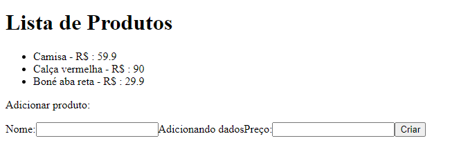

# Aula INW - DIA 08/05

## Comandos para abrir o projeto:

### Com o React 

- npx create-react-app helloworld

- cd helloworld

- npm start
##

 ### Com o site vitejs.dev
 
 - npm create vite@latest aula1 -- --template react

- npm run dev

